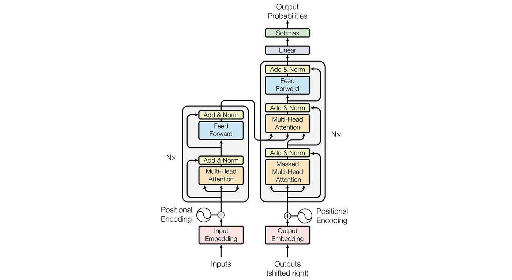

# Attention Is All You Need

[](https://www.python.org/)
[](https://pytorch.org/)
[](https://huggingface.co/)
[](LICENSE)

A PyTorch implementation of the Transformer architecture from the paper ["Attention Is All You Need"](https://arxiv.org/abs/1706.03762) for Neural Machine Translation (English → Vietnamese).

<p align="center">
  
</p>

## Repository Structure

The codebase is organized into modular components for easy understanding and extensibility. Core model architecture lives in `model/`, while training utilities are separated in `training/`. Configuration files use YAML format for easy customization.

```
transformer-from-scratch-remake/
├── config/              # Model & training configurations (YAML)
├── data/                # IWSLT2015 EN-VI dataset
├── model/               # Transformer architecture (encoder, decoder, layers)
├── tokenizer/           # WordLevel tokenizers (EN & VI)
├── training/            # Trainer, evaluator, scheduler, checkpointer
├── utils/               # Masks, translation, logging utilities
├── weights/             # Saved checkpoints
├── train.py             # Training entrypoint
├── inference.py         # Translation inference
└── evaluate.py          # Model evaluation
```

## Getting Started

Follow these steps to set up the development environment. A virtual environment is recommended to avoid dependency conflicts. GPU support requires CUDA-capable hardware and appropriate PyTorch installation.

### Prerequisites

- Python 3.8+
- CUDA-capable GPU (recommended for training)

### Installation

Clone the repository

```bash
git clone https://github.com/your-username/transformer-from-scratch-remake.git
cd transformer-from-scratch-remake
```

Create and activate a virtual environment

```bash
python -m venv venv

# Windows
venv\Scripts\activate

# Linux/macOS
source venv/bin/activate
```

Install dependencies

```bash
pip install -r requirements.txt
```

Download NLTK data (required for evaluation)

```python
import nltk
nltk.download('punkt')
nltk.download('punkt_tab')
```

## Usage

This section covers everything from configuration to deployment. You'll learn how to customize model hyperparameters, build tokenizers, train the model, and run inference. Evaluation metrics include BLEU, chrF++, and BERTScore.

### Configuration

Model and training configurations are defined in YAML files:

**Model Configuration** (`config/model.yaml`):

```yaml
src_vocab_size: 16000
tgt_vocab_size: 12000
d_model: 512
num_layers: 6
num_heads: 8
d_ff: 2048
max_seq_len: 40
dropout: 0.1
activation: gelu
```

**Training Configuration** (`config/train.yaml`):

```yaml
batch_size: 32
epochs: 30
learning_rate: 1.0
warmup_steps: 4000
optimizer: adamw
weight_decay: 0.0001
label_smoothing: 0.1
gradient_clip_norm: 1.0
```

### Vocabulary

The project uses **WordLevel tokenizers** built with Hugging Face Tokenizers library.

Special Tokens:

| Token | Description |
|-------|-------------|
| `[PAD]` | Padding token |
| `[UNK]` | Unknown token |
| `[BOS]` | Beginning of sequence |
| `[EOS]` | End of sequence |

Build tokenizers from training data:

```bash
python -m tokenizer.build_vocab
```

Output:

| File | Language | Vocab Size |
|------|----------|------------|
| `tokenizer/en_tokenizer.json` | English | 16,000 |
| `tokenizer/vi_tokenizer.json` | Vietnamese | 12,000 |

> **Note:** Pre-built tokenizers are already included in the repository. You only need to rebuild if you want to use a different vocabulary size or dataset.

### Training

Train the Transformer model:

```bash
python train.py --device cuda --batch-size 32 --epochs 30
```


| Argument | Description | Default |
|----------|-------------|---------|
| `--device` | Training device (`cuda` or `cpu`) | `cuda` |
| `--batch-size` | Override batch size from config | Config value |
| `--epochs` | Override number of epochs | Config value |
| `--resume` | Path to checkpoint for resuming | None |

Resume training from checkpoint:

```bash
python train.py --resume weights/last.pt
```

### Inference

Translate a sentence using the trained model:

```bash
python inference.py \
    --sentence "Hello, how are you?" \
    --checkpoint weights/best.pt \
    --strategy greedy \
    --device cpu
```

| Argument | Description | Default |
|----------|-------------|---------|
| `--sentence` | Input English sentence | `"hello"` |
| `--checkpoint` | Path to model checkpoint | `weights/best.pt` |
| `--strategy` | Decoding strategy (`greedy` or `beam`) | `greedy` |
| `--beam_size` | Beam size for beam search | `5` |
| `--max_seq_len` | Maximum output sequence length | `40` |
| `--device` | Inference device | `cpu` |

### Evaluation

Evaluate the model on the test set:

```bash
python evaluate.py \
    --checkpoint weights/best.pt \
    --src-file data/iwslt2015_en_vi/test.en \
    --ref-file data/iwslt2015_en_vi/test.vi \
    --strategy greedy \
    --device cuda
```

| Argument | Description | Default |
|----------|-------------|---------|
| `--checkpoint` | Path to trained model | Required |
| `--src-file` | Source sentences file | `data/iwslt2015_en_vi/test.en` |
| `--ref-file` | Reference translations file | `data/iwslt2015_en_vi/test.vi` |
| `--strategy` | Decoding strategy | `greedy` |
| `--beam-size` | Beam size for beam search | `4` |
| `--bert-model` | BERTScore model | `xlm-roberta-base` |
| `--device` | Evaluation device | `cpu` |

**Evaluation Metrics:**
- **BLEU** - Bilingual Evaluation Understudy
- **chrF++** - Character n-gram F-score
- **BERTScore** - Semantic similarity using BERT embeddings

## License

This project is licensed under the MIT License - see the [LICENSE](LICENSE) file for details.

## References

Key papers and resources that inspired this implementation. The original Transformer paper introduced the self-attention mechanism. The Annotated Transformer provides an excellent line-by-line explanation of the architecture.

- [Attention Is All You Need](https://arxiv.org/abs/1706.03762)
- [The Annotated Transformer](https://nlp.seas.harvard.edu/2018/04/03/attention.html)
- [IWSLT/mt_eng_vietnamese](https://huggingface.co/datasets/IWSLT/mt_eng_vietnamese)
